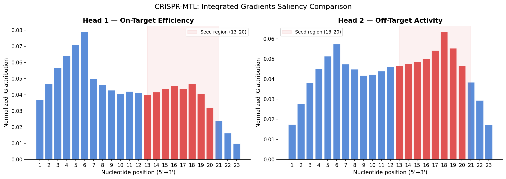

# CRISPR-MTL: Multi-Task Learning with DNABERT for Joint gRNA On-Target and Off-Target Prediction

CRISPR-MTL fine-tunes a single shared **DNABERT** encoder to predict two biologically
coupled properties of a CRISPR-Cas9 guide RNA at once: **on-target efficiency**
(how well the guide cuts its intended site, a regression task) and **off-target
activity** (whether the guide cuts unintended near-matching sites, a binary
classification task). Prior work models these two problems with separate networks,
yet both reflect the same underlying phenomenon — the strength and specificity of
gRNA–DNA binding. This project tests whether a shared sequence representation,
learned jointly, benefits both tasks, and uses Integrated Gradients to compare what
each task head attends to. It was built as a focused research sprint with full
ablations and an honest accounting of where the approach helps and where data
scarcity limits the conclusions.

---

## Key Findings

- **Multi-task is competitive with single-task DNABERT.** MTL-Full edges the best
  single-task on-target model (Spearman **0.812** vs **0.811**, within noise) and
  improves off-target *ranking* (AUROC **0.811** vs **0.771**) over single-task
  DNABERT — supporting the hypothesis that a shared encoder transfers usefully
  across the two tasks.
- **Ablations validate the architecture.** Freezing all DNABERT layers (ABL1)
  collapses both tasks (Spearman 0.661, AUROC 0.764), so **fine-tuning layers 9–12
  is critical**. Fine-tuning *all* layers (ABL2) **hurts** on-target (0.769) without
  helping AUROC — evidence of catastrophic forgetting on a small dataset. A
  **combined loss (ABL3) beats alternating** on off-target (AUROC 0.833, AUPR 0.059
  vs MTL-Full's 0.811 / 0.040).
- **The two heads rely on different sequence features.** Integrated Gradients shows
  the off-target head concentrates on the **seed region (positions 13–20)**, while
  the on-target head is **more distributed** across the guide — consistent with the
  biology of Cas9 mismatch sensitivity and confirming the tasks are related but not
  identical.
- **Honest limitation.** The merged off-target corpus contains only **53 positive
  examples**, which makes **AUPR estimates unreliable and high-variance** (note
  MTL-Full's AUPR is *lower* than single-task despite a higher AUROC). The
  from-scratch model with explicit mismatch encoding (A2) remains **competitive on
  off-target**, so DNABERT is not a clear winner on the minority-class metric here.

---

## Architecture

```
        ON-TARGET INPUT                     OFF-TARGET INPUT
   [CLS] + 18 k-mer + [SEP]        [CLS] + 18 gRNA [SEP] + 18 DNA [SEP]
        (20 tokens)                          (38 tokens)
              |                                    |
              +------------------+-----------------+
                                 |
                      SHARED ENCODER: DNABERT
                  (zhihan1996/DNA_bert_6, 12 layers)
                   Layers 1-8  : frozen always
                   Layers 9-12 : frozen (Phase 1) -> fine-tuned (Phase 2)
                                 |
                   [CLS] representation (768-dim)
                                 |
                   Dropout(0.1) -> Linear(768->256)
                        -> GELU -> LayerNorm           (shared projection)
                                 |
              +------------------+------------------+
              |                                     |
       HEAD 1: ON-TARGET                   HEAD 2: OFF-TARGET
        (regression)                        (classification)
   Linear(256->64) + ReLU              Linear(256->64) + ReLU
   Dropout(0.2)                        Dropout(0.3)
   Linear(64->1) + Sigmoid             Linear(64->1) + Sigmoid
              |                                     |
       efficiency score                    off-target probability
          (0.0 - 1.0)                          (0.0 - 1.0)
```

---

## Results

All metrics are **5-fold cross-validation, mean ± std**. On-target uses Spearman
(primary) correlation; off-target uses AUROC (primary) and AUPR (secondary, on a
~0.5% positive base rate).

### On-Target Efficiency (Spearman)

| Model | Encoder | Spearman |
|---|---|---|
| A1 | BiLSTM (from scratch) | 0.806 ± 0.016 |
| B1 | DNABERT (single-task) | 0.811 ± 0.017 |
| **MTL-Full** | **DNABERT (multi-task)** | **0.812 ± 0.025** |

### Off-Target Activity (AUROC / AUPR)

| Model | Encoder | AUROC | AUPR |
|---|---|---|---|
| A2 | CNN-BiLSTM (from scratch) | 0.939 ± 0.044 | 0.226 ± 0.199 |
| B2 | DNABERT (single-task) | 0.771 ± 0.100 | 0.082 ± 0.114 |
| **MTL-Full** | **DNABERT (multi-task)** | **0.811 ± 0.122** | **0.040 ± 0.026** |

### Ablation Study (single-run point estimates; MTL-Full for reference)

| Variant | Change vs MTL-Full | Spearman | AUROC | AUPR |
|---|---|---|---|---|
| ABL1 | Freeze all DNABERT layers | 0.661 | 0.764 | — |
| ABL2 | Fine-tune all DNABERT layers | 0.769 | 0.811 | — |
| ABL3 | Combined loss (alpha = 0.5) | 0.804 | 0.833 | 0.059 |
| MTL-Full | (reference: alternating, fine-tune 9–12) | 0.812 | 0.811 | 0.040 |

Read together: layer-selective fine-tuning (9–12) is necessary (ABL1 fails), full
fine-tuning is counterproductive on this data scale (ABL2), and combined loss is a
viable alternative to alternating batches for the off-target head (ABL3).

---

## Interpretability



Per-nucleotide Integrated Gradients attributions for both heads of the best
MTL-Full checkpoint. The off-target head's importance is concentrated in the seed
region (positions 13–20), whereas the on-target head spreads attention across the
full guide — the two tasks read the same sequence differently.

---

## Repository Structure

```
CRISPR-MTL/
├── README.md                  # this file
├── requirements.txt           # dependencies (no version pinning)
├── configs/
│   └── config.yaml            # all hyperparameters and paths
├── data/
│   ├── README.md              # how to obtain the three datasets
│   ├── on-target/             # Doench 2016 CSV
│   ├── off-target/            # DeepCRISPR + Listgarten files
│   └── processed/             # generated CV splits (cv_splits.pkl)
├── docs/
│   └── research-plan.md       # full research proposal
├── notebooks/
│   ├── EDA.ipynb              # exploratory data analysis
│   └── experiment.ipynb       # run experiments + report + saliency
├── scripts/
│   └── explore_data.py        # dataset format inspection
├── src/
│   ├── dataset.py             # loading, tokenization, CV splits
│   ├── model.py               # 4 model classes (baselines + MTL)
│   ├── train.py               # training loops, two-phase fine-tuning
│   └── evaluate.py            # metrics, report, Integrated Gradients
└── outputs/                   # checkpoints, results, figures (not tracked)
```

---

## Quick Start

```bash
# 1. Clone
git clone https://github.com/luminolous/CRISPR-MTL.git
cd CRISPR-MTL

# 2. Install dependencies (Python 3.10+; a virtualenv is recommended)
pip install -r requirements.txt

# 3. Obtain the datasets
#    Follow data/README.md to place the three benchmark files under data/.

# 4. Run experiments
#    Open notebooks/experiment.ipynb and run cell by cell.
#    Each experiment saves checkpoints and skips folds already trained.
```

Experiments target a single GPU (Kaggle P100 / Colab T4 / local 6 GB+ card) and fall
back to CPU automatically. Mixed precision (fp16) is enabled on CUDA to fit larger
batches. The interpretability cell runs comfortably on CPU.

---

## Methodology

- **Datasets.** On-target: Doench et al. 2016 (5,310 guides; 23-mer extracted from
  the 30-mer, efficiency clipped to [0, 1]). Off-target: DeepCRISPR benchmark +
  Listgarten GUIDE-seq, merged and deduplicated by (gRNA, DNA) pair
  (10,221 pairs, 53 positives).
- **Backbone.** DNABERT `zhihan1996/DNA_bert_6` — a BERT pretrained on the human
  genome with 6-mer tokenization (12 layers, 768 hidden, ~110M parameters).
- **Two-phase fine-tuning.** *Phase 1 (warm-up):* all DNABERT layers frozen, only
  the shared projection and task heads train (lr = 1e-4). *Phase 2:* layers 9–12
  unfrozen with a 10× smaller discriminative learning rate (1e-5) and a
  ReduceLROnPlateau schedule.
- **Multi-task strategy.** MTL-Full uses **alternating batches** — one on-target
  step then one off-target step, each optimizing its own loss (MSE for on-target;
  class-weighted BCE for off-target). ABL3 instead uses a **combined loss**
  (0.5·L_on + 0.5·L_off). Off-target class weighting uses w_pos = n_neg/n_pos,
  capped at 50.
- **Evaluation.** 5-fold cross-validation, seed 42. On-target folds use KFold;
  off-target folds use **StratifiedGroupKFold grouped by gRNA**, which keeps the
  positive class balanced while preventing the same guide from leaking across
  train/validation splits.
- **Interpretability.** Captum `LayerIntegratedGradients` on the DNABERT embedding
  layer (50 Riemann steps), with k-mer token attributions aggregated back to
  per-nucleotide importance and compared between heads.

---

## Limitations

The central caveat is data scale on the off-target side: with only **53 positive
examples** across the merged corpus (≈10 per validation fold), AUPR (the metric
most sensitive to minority-class performance) is **noisy and not reliably
comparable** between models. MTL-Full's higher AUROC alongside a lower AUPR than
single-task DNABERT is a direct symptom of this, and the from-scratch mismatch model
(A2) staying competitive means we cannot claim DNABERT dominance on off-target.
On-target gains from multi-task learning are real but **marginal and within
cross-validation variance**. The off-target sources are also not sample-overlapping
with on-target, so multi-task signal is shared only through the encoder via
alternating updates rather than through truly joint examples. No wet-lab validation
was performed, and only the original DNABERT was evaluated — newer DNA foundation
models (DNABERT-2, Nucleotide Transformer, HyenaDNA) are left to future work.

---

## Demo

Interactive Gradio demo: https://lumicero-crispr-lens.hf.space/